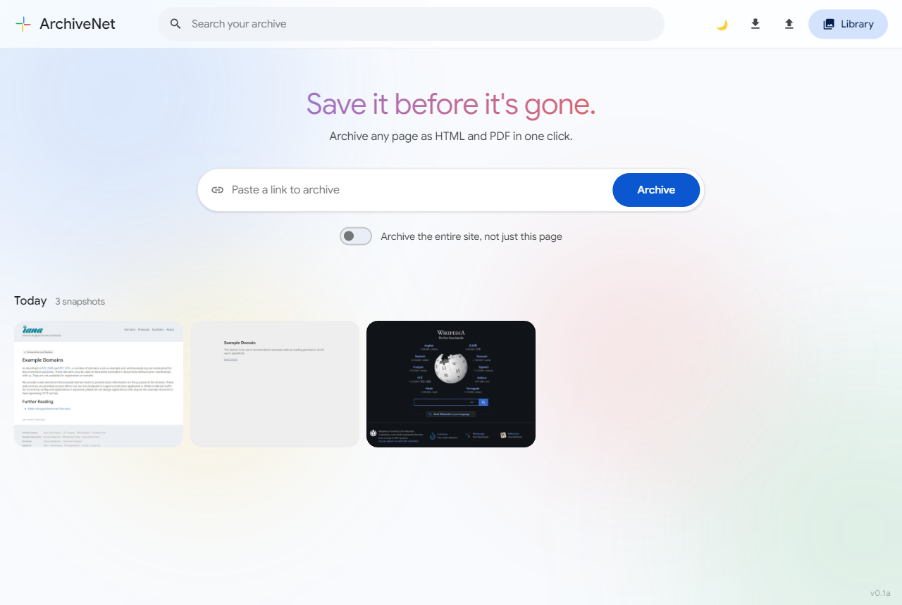
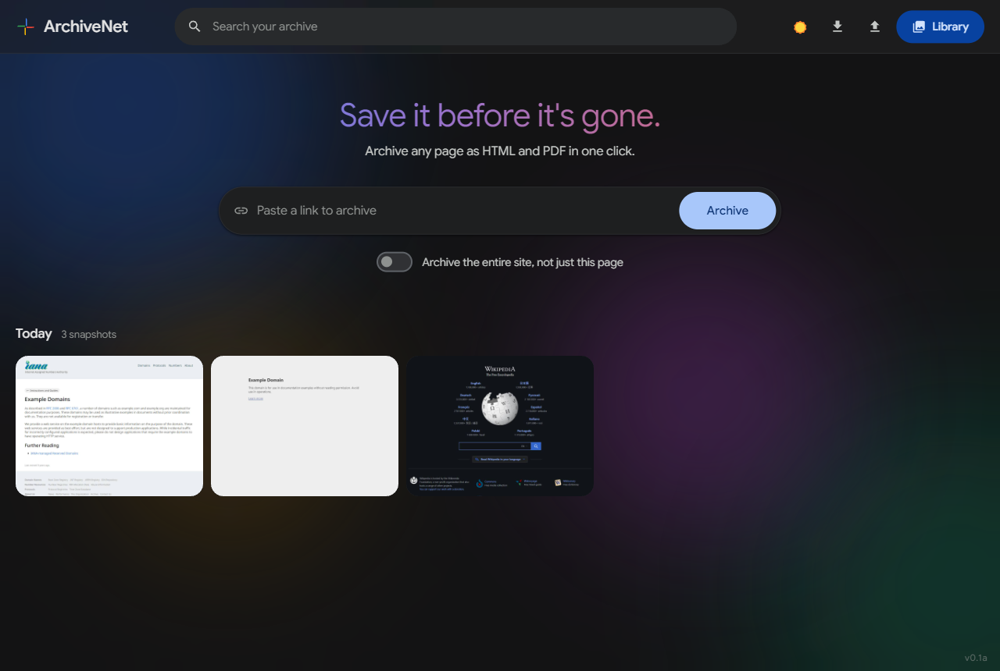
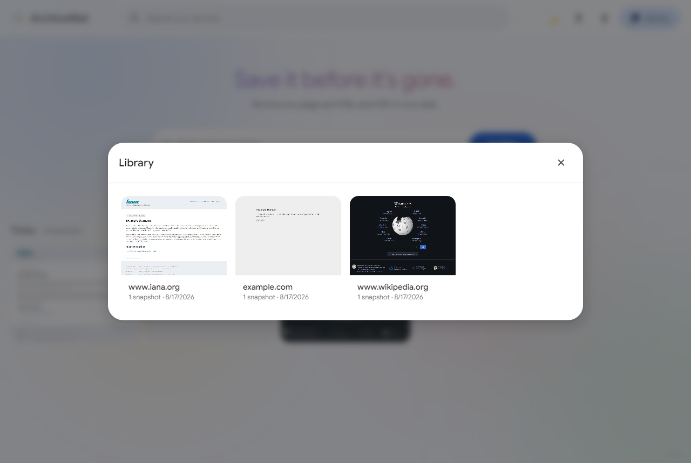
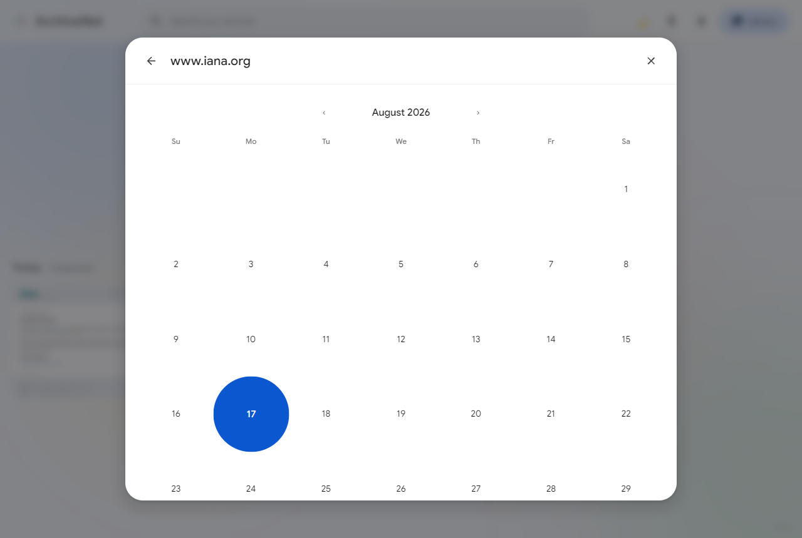
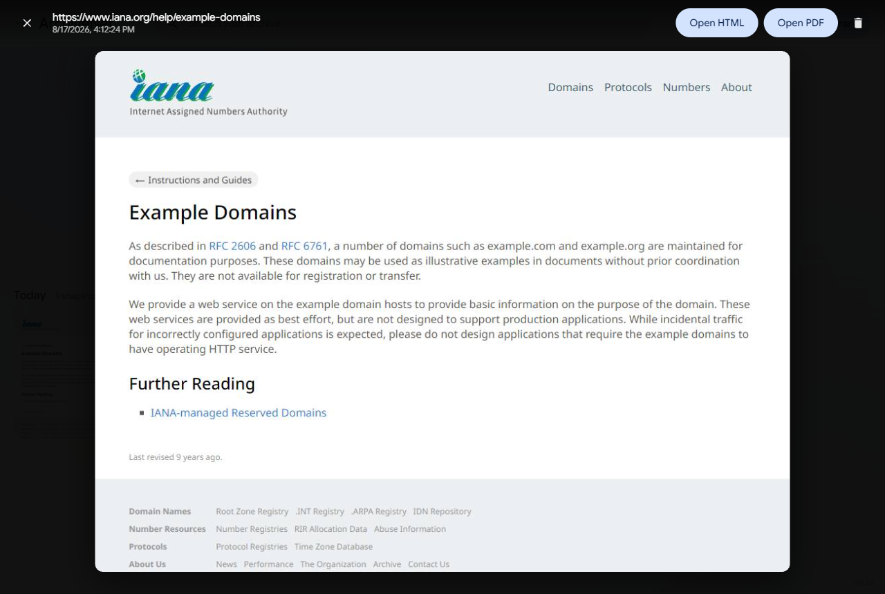

# TimeCapsule


**A self-hosted, open-source alternative to Archive.org and ArchiveBox.** Paste a URL into the address bar and TimeCapsule renders it in headless Chrome, then saves a real, self-contained HTML snapshot, a PDF, and a thumbnail — all on your own disk, under your own control.

The UI is a Google Photos-style timeline: every snapshot you've ever taken, grouped by day, in one scrollable grid — click any thumbnail to open it full-screen.

## Screenshots

<table>
<tr>
<td width="50%"></td>
<td width="50%"></td>
</tr>
<tr>
<td align="center"><sub><b>Timeline</b> — light mode</sub></td>
<td align="center"><sub><b>Timeline</b> — dark mode, with the animated aurora background</sub></td>
</tr>
<tr>
<td width="50%"></td>
<td width="50%"></td>
</tr>
<tr>
<td align="center"><sub><b>Library</b> — every archived site, thumbnail-first</sub></td>
<td align="center"><sub><b>Calendar</b> — every date a site was archived, Wayback-Machine-style</sub></td>
</tr>
</table>


<p align="center"><sub><b>Viewer</b> — open any snapshot full-screen, with Open HTML / Open PDF / Delete right there</sub></p>

## Contents

- [Screenshots](#screenshots)
- [Features](#features)
- [Installing](#installing)
- [Running on a Workstation](#running-on-a-workstation)
- [Managing the Service](#managing-the-service)
- [Hosting as a Server](#hosting-as-a-server)
- [How It Works](#how-it-works)
  - [How pages are captured](#how-pages-are-captured)
  - [Recursive archiving](#recursive-archiving)
  - [Directory layout](#directory-layout)
  - [Export and import](#export-and-import)
  - [Dark mode](#dark-mode)
  - [Logging](#logging)
- [Configuration reference](#configuration-reference)
- [Requirements](#requirements)

## Features

| Feature | What it does |
|---|---|
| **Archive** | Paste a URL, get back HTML + PDF + a thumbnail, saved to disk. |
| **Timeline** | Every snapshot you've ever taken, newest first, grouped into "Today" / "Yesterday" / dated sections — just like Google Photos. Click a thumbnail to open it full-screen in a lightbox, with Open HTML / Open PDF / Delete right there. |
| **Recursive archiving** | Optionally crawl and archive an entire site instead of just the page you typed (warns you first — it's much heavier). |
| **Search** | Live search across every archived URL, including sub-links, from the top bar. |
| **Library** | A thumbnail grid of every archived site; click through to a Wayback-Machine-style calendar of every date it was archived. Delete a single day's snapshots from the calendar, or an entire site's history from the grid. |
| **Export / Import** | Back up everything to a single `.zip` and restore it later — including onto a different OS. |
| **Dark mode** | Follows your system theme by default; toggle it manually from the top bar. The animated background changes mood with it — soft pastels in light mode, a glowing aurora in dark mode. |
| **Logging** | Prints progress to the terminal as pages are archived, and appends every archive request (URL + requester IP) to `traffic.log`. |

## Installing

**Prerequisites:** [Node.js](https://nodejs.org/) 18 or newer. On Linux you'll also need a handful of Chromium system libraries — see [Requirements](#requirements).

```
git clone <this-repository-url>
cd TimeCapsule
npm install
```

The first install downloads a bundled Chromium via Puppeteer's postinstall script. If your environment blocks install scripts (e.g. npm's `allow-scripts` guard, or a locked-down CI runner), approve it first, then install again:

```
npm approve-scripts puppeteer
npm install
```

## Running on a Workstation

For personal, local-only use — nothing else needs to reach it:

```
npm start
```

Open `http://localhost:3000`, archive some pages, and press `Ctrl+C` in the terminal when you're done. That's the whole workflow: no background service, no database, just this one process while you're using it. Archived files land in `archived/` right next to the project.

Use a different port if 3000 is taken:

```
PORT=8080 npm start
```

## Managing the Service

This section is for running TimeCapsule continuously — e.g. always-on on a home server or NAS — as opposed to starting it only when you want to use it.

**Starting / stopping / restarting**, using [pm2](https://pm2.keymetrics.io/) as a process manager:

```
npm install -g pm2
pm2 start server.js --name timecapsule   # start
pm2 stop timecapsule                     # stop
pm2 restart timecapsule                  # restart
pm2 logs timecapsule                     # tail logs
```

Running it as a systemd service instead is covered under [Hosting as a Server](#hosting-as-a-server) — that also makes it survive a reboot.

**Updating to a new version:**

```
git pull
npm install
pm2 restart timecapsule   # or just re-run `npm start` if you run it in the foreground
```

`npm install` re-checks Puppeteer's bundled Chromium and only re-downloads it if the required version changed.

**Backing up:** everything TimeCapsule knows lives under `archived/`. Click Export in the top bar (or hit `GET /api/export`) to download it as a single `.zip` — see [Export and import](#export-and-import) for the full picture, including moving to a different OS entirely.

**Changing the port:** set the `PORT` environment variable before starting. With pm2, set it on the first launch (`PORT=8080 pm2 start server.js --name timecapsule`) — pm2 remembers the environment from that run.

## Hosting as a Server

TimeCapsule is a plain Node/Express process — any host that can run a long-lived Node service works, from a spare machine at home to a small VPS. This walks through setting it up on a **dedicated server that stays on 24/7**, so it just keeps archiving whenever you need it without you having to start it by hand.

1. **Get the code onto the server** and run `npm install` there (Chromium is downloaded per-platform, so don't just copy `node_modules/` from a different OS).
2. **Keep it running** with pm2 (see [Managing the Service](#managing-the-service)) and make it survive reboots:
   ```
   pm2 save
   pm2 startup   # wires pm2 into your OS's boot process
   ```
   Or use a systemd unit instead:
   ```ini
   # /etc/systemd/system/timecapsule.service
   [Unit]
   Description=TimeCapsule
   After=network.target

   [Service]
   WorkingDirectory=/opt/timecapsule
   ExecStart=/usr/bin/node server.js
   Environment=PORT=3000
   Restart=on-failure
   User=timecapsule

   [Install]
   WantedBy=multi-user.target
   ```
   Then `sudo systemctl enable --now timecapsule`.
3. **Put a reverse proxy in front of it** (nginx, Caddy, etc.) to handle TLS and your domain name, proxying to `http://127.0.0.1:3000`. Caddy example:
   ```
   archive.yourdomain.com {
     reverse_proxy 127.0.0.1:3000
   }
   ```
   If you plan to use [recursive archiving](#recursive-archiving) on larger sites, raise your proxy's read/response timeout (e.g. nginx's `proxy_read_timeout`) — the request to `/api/archive` doesn't return until the whole crawl finishes, and a big one can take a while.
4. **Persist the `archived/` directory.** It holds every saved archive, so back it up like you would a database and, if you containerize the app, mount it as a volume rather than baking it into the image.
5. **Access control.** TimeCapsule has no authentication of its own — anything reachable can trigger an archive and browse `archived/`. If exposing it beyond your local network, put it behind your reverse proxy's auth (e.g. Caddy's `basic_auth`, an nginx `auth_basic` block, or a VPN/tailnet) rather than the open internet.

### Docker (optional)

If you prefer a container, Puppeteer's official base image already includes Chromium and its dependencies:

```dockerfile
FROM ghcr.io/puppeteer/puppeteer:22.15.0
WORKDIR /app
COPY package*.json ./
RUN npm install
COPY . .
ENV PORT=3000
EXPOSE 3000
CMD ["node", "server.js"]
```

Mount `archived/` as a volume so archives survive container restarts:

```
docker build -t timecapsule .
docker run -d -p 3000:3000 -v $(pwd)/archived:/app/archived --name timecapsule timecapsule
```

### Keeping it healthy long-term

A couple of things are worth checking in on periodically once TimeCapsule has been running unattended for a while, since neither grows on its own until you notice — they just quietly get bigger:

- **`archived/` grows without limit.** Every archive adds an HTML file, a PDF, and a thumbnail, and [recursive archiving](#recursive-archiving) multiplies that by up to 100 pages per run. Keep an eye on free disk space (`df -h` on Linux) and prune old sites you don't need from the [Library](#features) view, or export and move them elsewhere with [Export and import](#export-and-import).
- **`traffic.log` grows without limit too**, one line per archive request forever. On Linux, hand it to `logrotate` rather than letting it grow unbounded:
  ```
  # /etc/logrotate.d/timecapsule
  /opt/timecapsule/traffic.log {
    weekly
    rotate 8
    compress
    missingok
    notifempty
  }
  ```
- **Crash recovery is already handled** by the setup above — pm2 restarts a crashed process automatically, and the systemd unit's `Restart=on-failure` does the same — so there's nothing extra to configure there, just something worth knowing is already covered.

## How It Works

### How pages are captured

Getting a faithful, self-contained snapshot from a live page takes more than one `page.content()` call, so `lib/archiver.js` does the following for every URL it archives:

1. Loads the page and waits for the network to go idle.
2. **Scrolls through the full page and waits again.** Lots of sites only fetch images (or trigger other lazy-loaded content) once an element scrolls into view; without this step those images are missing from both the PDF and the saved HTML.
3. Captures the PDF and thumbnail from that fully-loaded state.
4. **Inlines every stylesheet, image, and font it saw load as a `data:` URI directly into the HTML**, and rewrites any it couldn't capture (too large, blocked, etc.) to an absolute URL instead of a relative one. This is what makes `page.html` open correctly on its own, later, on another machine, with no dependency on the original site still being up or reachable at the same relative paths.
5. **Strips `<script>` tags** from the saved HTML. The DOM has already been fully rendered by that point, so scripts add no visual value in a static snapshot — keeping them would only risk them re-executing against a site that's since changed or gone offline (broken widgets, tracking pings, JS errors).
6. Rewrites `<a href>` links to absolute URLs so they still work (by going back to the live site) when you open an archived page later.

Known limitation: assets loaded from Chromium's disk cache (rather than over the network) can occasionally fail to inline; when that happens the archiver falls back to an absolute URL for that one asset rather than failing the whole capture.

### Recursive archiving

By default, TimeCapsule only archives links found directly on the page you typed in (up to `MAX_SUBLINKS`, 15). Checking **Recursive** under the address bar archives the whole site instead: it follows same-domain links breadth-first — pages found on those sub-pages get crawled too, and so on — until either there's nothing left to follow or it hits the `MAX_RECURSIVE_PAGES` safety cap (100 pages, including the main one). All of it still lands in the same place: `archived/<domain>/<timestamp>/sub-links/<path>/<timestamp>/`, exactly like non-recursive sub-links do.

The UI warns before you enable it because a full-site crawl is dramatically heavier than a normal archive: many more pages means many more HTML/PDF/thumbnail files (a lot more disk space) and a much longer archive run, since every page still gets the full capture treatment (scroll, wait, inline assets, PDF, screenshot) one at a time. If the site has more pages than the cap allows, the response — and the completion toast — say so rather than silently archiving only part of the site without telling you.

### Directory layout

```
archived/
  example.com/
    2026-07-25_21-35-56/            <- the URL you typed (https://example.com/blog/post)
      page.html
      page.pdf
      thumbnail.jpg
      metadata.json
      sub-links/
        blog/
          post-1/
            2026-07-25_21-36-10/    <- https://example.com/blog/post-1, found on that page
              page.html
              page.pdf
              thumbnail.jpg
              metadata.json
```

- The URL you type always becomes `archived/<domain>/<timestamp>/`, whether or not it has a path.
- Same-domain links discovered on that page are archived inside that same folder, under `sub-links/<path>/<timestamp>/` (see [Recursive archiving](#recursive-archiving) for how many).
- The timeline, Search, Library, and calendar views are all derived by walking this directory tree (`lib/history.js`) — there's no separate database.

### Export and import

Everything TimeCapsule knows is just files under `archived/` — folder and file names use only plain ASCII, so the archive tree itself is already portable across Windows/macOS/Linux. Export/Import just wraps that in a single file for convenience:

- **Export** (top bar, or `GET /api/export`) downloads a `.zip` of the entire `archived/` directory.
- **Import** (top bar, or `POST /api/import` with the zip as a `multipart/form-data` field named `archive`) extracts that zip into `archived/` on whatever machine you run it on. Existing archives already on that machine are kept — importing merges rather than replaces, so it's also safe to combine two machines' archives into one.

To move to a different OS: click Export on the old machine, copy the `.zip` over by whatever means (USB drive, cloud storage, `scp`, etc.), [install](#installing) TimeCapsule on the new machine, start it, and click Import.

### Dark mode

TimeCapsule follows your system's light/dark preference (`prefers-color-scheme`) the first time you open it. Use the 🌙/☀️ toggle in the top-right of the app bar to override that — your choice is remembered in the browser (`localStorage`) and takes precedence over the system setting from then on, independently per browser/device.

### Logging

While it's running, TimeCapsule prints one line per event to the terminal, each timestamped:

```
[2026-07-26T05:09:50.014Z] Archive requested: https://example.com/ from ::1
[2026-07-26T05:09:51.903Z]   [::1] archived https://example.com/
[2026-07-26T05:09:51.920Z] Archive completed: https://example.com/ (0 sub-link(s)) for ::1
```

For a recursive or many-sub-link archive, every page gets its own `archived <url>` line (or `failed <url>: <reason>` if that one page couldn't be captured) as it happens, so you can watch the crawl's progress in real time rather than waiting on one big response at the end.

Every top-level archive request also appends one line to `traffic.log` in the project root — the website that was requested, followed by the requester's IP:

```
2026-07-26T05:09:50.014Z https://example.com/ 127.0.0.1
2026-07-26T05:10:00.147Z https://www.iana.org/help/example-domains 192.168.1.42
```

(Sub-links discovered and archived along the way show up in the terminal output, not as separate `traffic.log` lines — the log tracks *requests*, one per site a client actually asked for.) The IP is always normalized to IPv4 where possible — Node's dual-stack server reports IPv4 clients as an IPv6-mapped address (`::ffff:1.2.3.4`) or the IPv6 loopback (`::1`), and both get converted back to plain IPv4 before logging. If TimeCapsule is behind a reverse proxy, the IP recorded is taken from the `X-Forwarded-For` header when present (which nginx and Caddy set by default), falling back to the direct connection's address otherwise.

All of this — what gets printed, what gets written to `traffic.log`, and in what format — is controlled from one place: `lib/logger.js`. Edit `log()` or `logTraffic()` there to change it (e.g. write JSON lines instead, log to a different file, or add fields).

## Configuration reference

| Setting | Default | Where | Purpose |
|---|---|---|---|
| `PORT` (env var) | `3000` | shell environment | Port the server listens on |
| `MAX_SUBLINKS` | `15` | `lib/archiver.js` | Non-recursive archiving: max links archived from the one page you typed |
| `MAX_RECURSIVE_PAGES` | `100` | `lib/archiver.js` | Recursive archiving: max total pages crawled per site, including the main page |

## Requirements

- [Node.js](https://nodejs.org/) 18 or newer.
- On Linux, Chromium (used via Puppeteer) needs a few system libraries. If `npm start` fails to launch the browser, install them, e.g. on Debian/Ubuntu:
  ```
  sudo apt-get install -y ca-certificates fonts-liberation libasound2 libatk-bridge2.0-0 \
    libatk1.0-0 libcups2 libdbus-1-3 libdrm2 libgbm1 libgtk-3-0 libnspr4 libnss3 \
    libxcomposite1 libxdamage1 libxfixes3 libxkbcommon0 libxrandr2 xdg-utils
  ```
